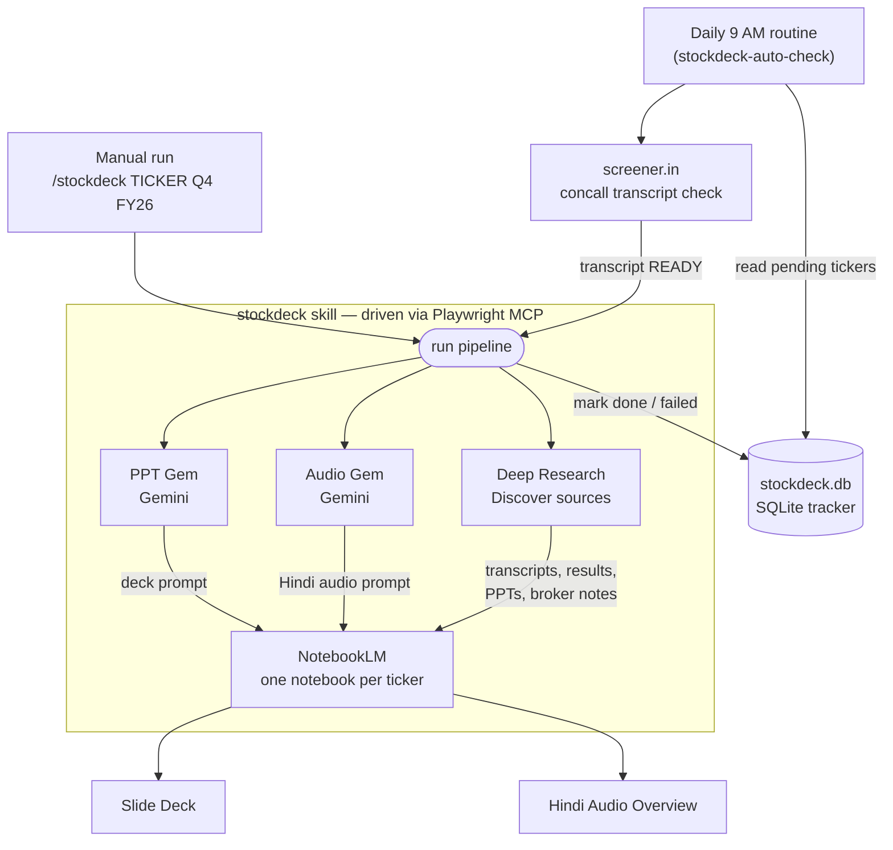
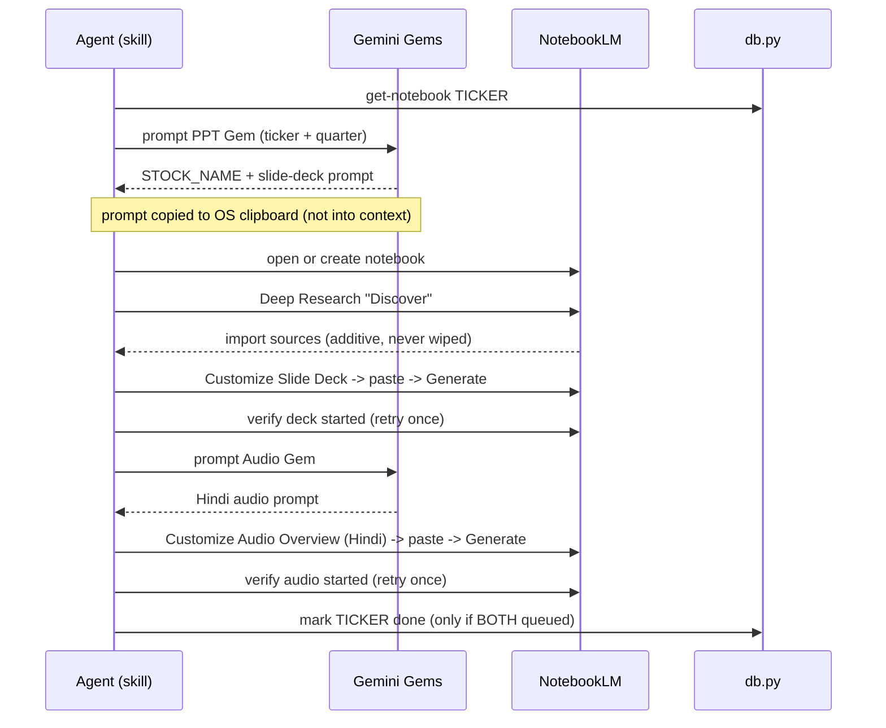
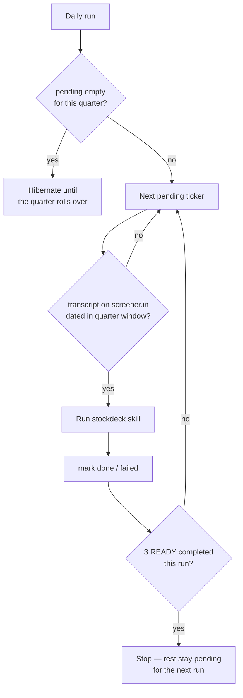

# stockdeck

Automated pipeline that turns an Indian-market quarterly result into a **NotebookLM slide deck + a Hindi audio overview**, driven end-to-end by browser automation.

Give it a ticker and a fiscal quarter (e.g. `RELIANCE Q4 FY26`) and it:

1. Asks two purpose-built **Gemini Gems** to write fresh, search-grounded NotebookLM prompts — one for a slide deck, one for a Hindi audio briefing.
2. Drives **NotebookLM** (via the Playwright MCP) using **one persistent notebook per ticker** — adding each quarter's sources via Deep Research (never deleting), so the notebook accumulates a multi-quarter history for YoY/QoQ correlation.
3. Generates both the **Slide Deck** and the **Hindi Audio Overview**, and verifies each actually started before recording success.

A companion daily routine checks screener.in for newly-released concall transcripts and runs the pipeline automatically for any watchlist ticker whose results are out.

## Architecture



- **Sources** come from NotebookLM **Deep Research** ("Discover"), which finds transcripts, results, investor presentations and broker notes for the quarter.
- **Grounding is strict** — both Gems instruct NotebookLM to ground every claim in the uploaded documents and to say "not disclosed" rather than estimate.
- **Prompts never enter the agent's context** — each Gem's output is moved Gemini → NotebookLM over the OS clipboard, so the multi-KB prompt body costs ~zero tokens.

## How it works

### Per-ticker run



### Daily auto-check routine



The quarter → reporting-window mapping (with a late-reporter tolerance month) is:

| Target quarter | Concall months accepted |
|----------------|-------------------------|
| Q1 FY*yy*      | Jul / Aug / Sep 20*(yy-1)* |
| Q2 FY*yy*      | Oct / Nov 20*(yy-1)* |
| Q3 FY*yy*      | Jan / Feb / Mar 20*yy* |
| Q4 FY*yy*      | Apr / May / Jun / Jul 20*yy* |

## Repo contents

| Path | What it is |
|------|------------|
| `SKILL.md` | The full automation skill — the step-by-step playbook the agent follows, including field-tested fixes for the NotebookLM / Gemini UIs. |
| `db.py` | Local SQLite tracker: per-quarter watchlist, per-ticker notebook IDs, and done/failed status so the routine never re-runs a covered ticker. |
| `gems/ppt_gem.md` | System instruction for the **PPT** Gemini Gem (the slide-deck prompt generator). |
| `gems/audio_gem.md` | System instruction for the **Audio** Gemini Gem (the Hindi briefing prompt generator). |

## Setup (bring your own accounts)

This is a personal automation; to run it you supply your own:

- A Google account signed into **Gemini** and **NotebookLM** (NotebookLM Pro recommended — 300 sources/notebook).
- Two **Gemini Gems** created from `gems/ppt_gem.md` and `gems/audio_gem.md`; put their Gem URLs into `SKILL.md`.
- The **Playwright MCP** (`@playwright/mcp`) pointed at a Chromium profile that's already signed into Google.
- Python 3 for `db.py`. Initialise with `python db.py init`, then edit the `WATCHLIST` to your own tickers.

### db.py quick reference

```
python db.py init                  # create schema + seed watchlist + default quarter
python db.py pending               # tickers not yet done for the current quarter
python db.py set-quarter "Q1 FY27" # roll over to a new quarter (resets pending)
python db.py get-notebook TICKER   # this ticker's NotebookLM notebook id
python db.py mark TICKER done       # record outcome (done | failed | skipped)
python db.py status                # summary counts for the current quarter
```

> The Gem prompt instructions in `gems/` are the interesting part — they're reusable on their own for anyone generating institutional-grade equity research prompts.

## Note

Built for personal use to track an Indian-equity watchlist. No warranty; not investment advice.
